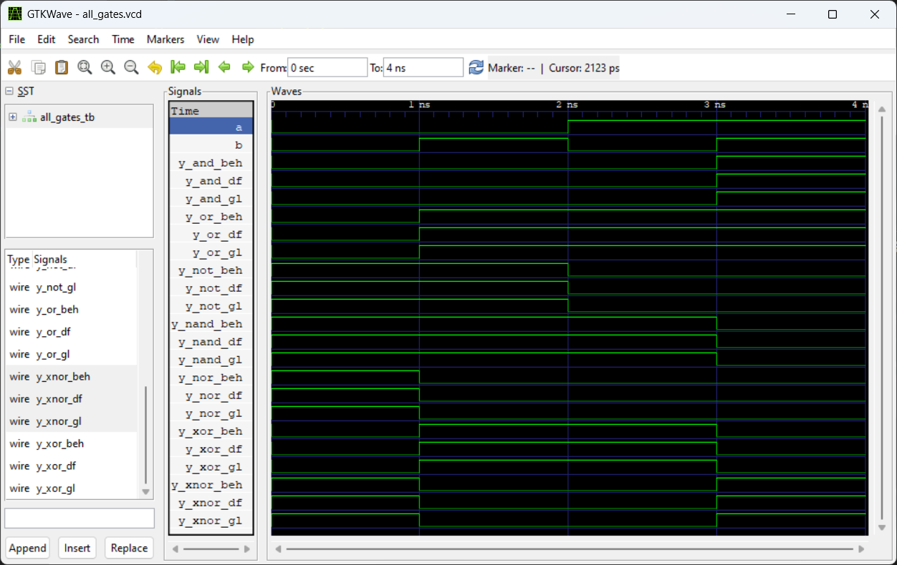
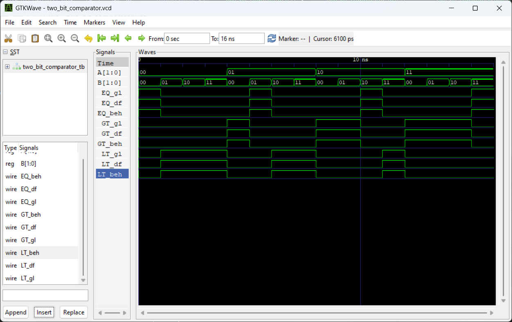
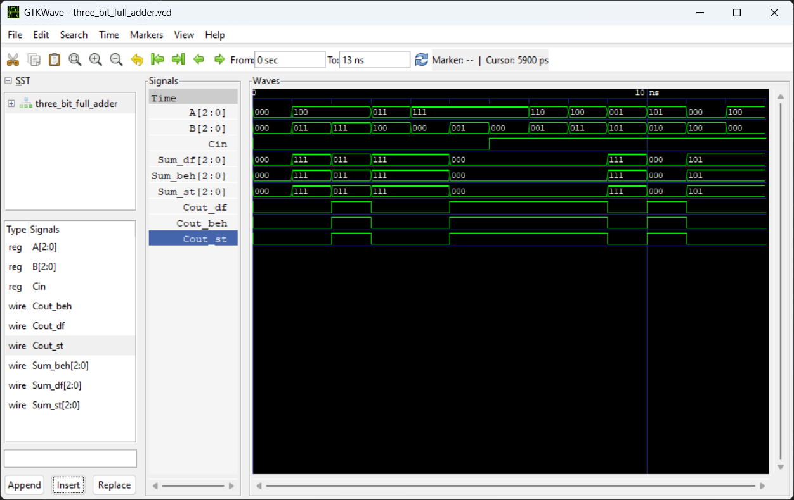
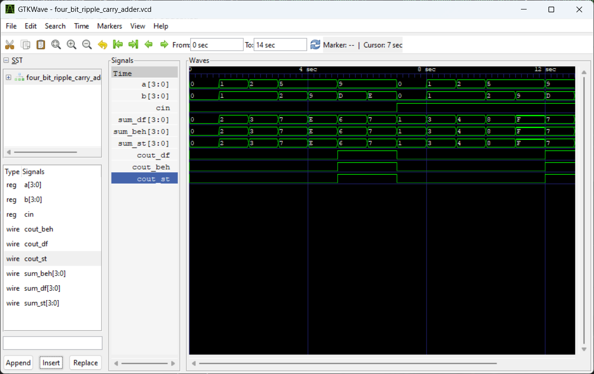
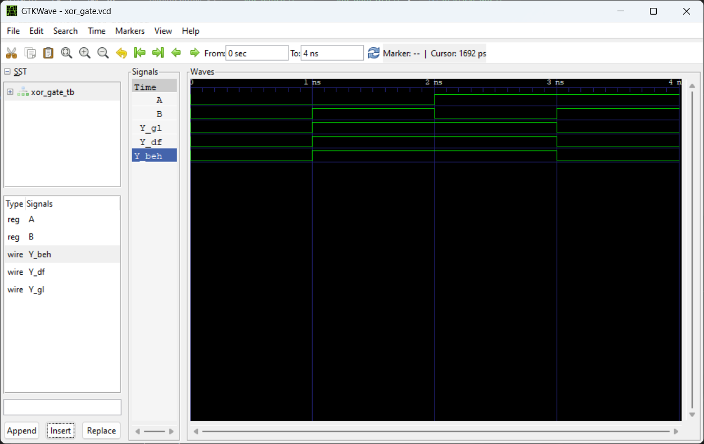

# Assignments

1. Construct all logic gates (and, or, not, nand, nor, xor, xnor) by gate-level, dataflow, and behavioral-level modeling.
2. Implement 2-bit comparator by dataflow, behavioral-level, and structural modeling.
3. Implement 3-bit full adder by dataflow, behavioral-level, and structural modeling.
4. Implement 4-bit ripple carry adder by dataflow, behavioral-level, and structural modeling.
5. Create XOR gate using NAND gates only by behavioral, and structural modelling.

## Screenshots of Simulation Waveforms

### 1. All logic gates

### 2. 2-Bit Comparator

### 3. 3-Bit Full Adder

### 4. 4-Bit Ripple Carry Adder

### 5. XOR Gate Using NAND Gates Only

