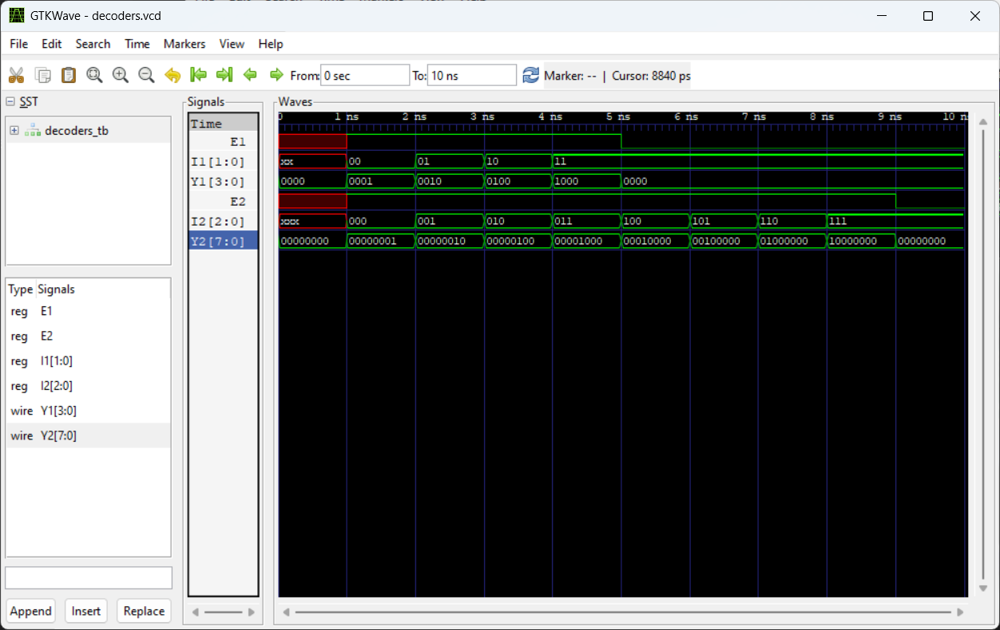
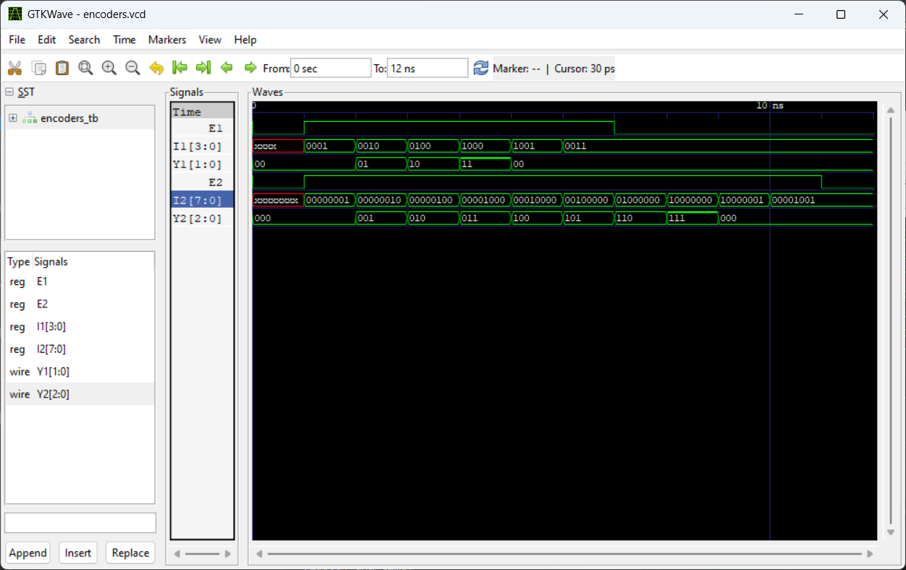
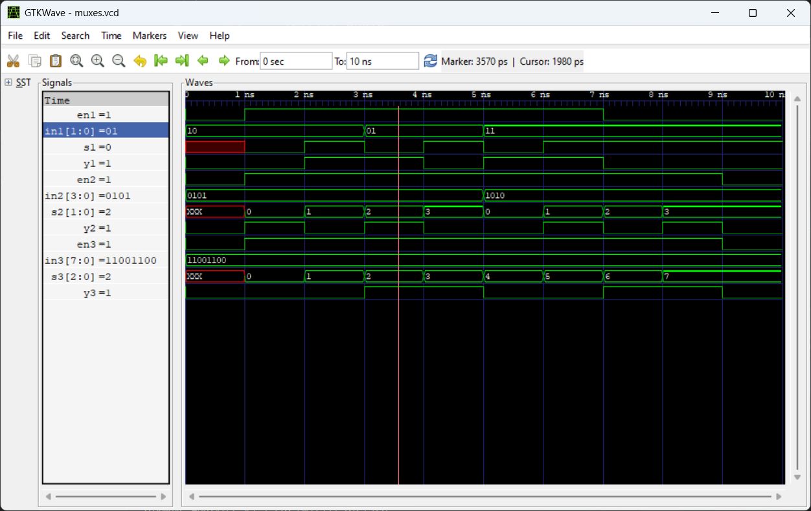
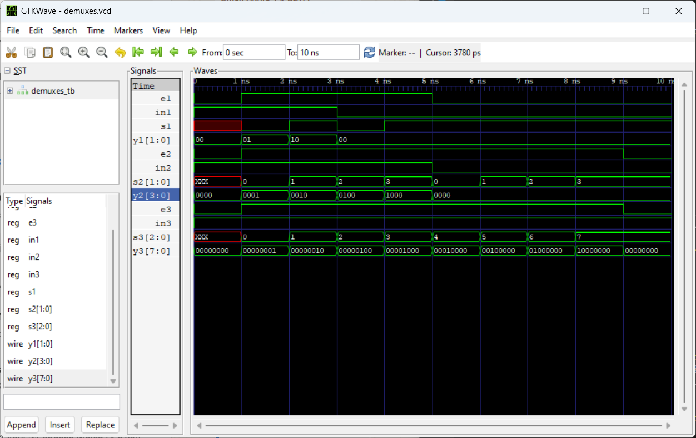
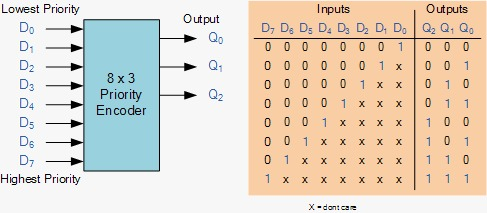
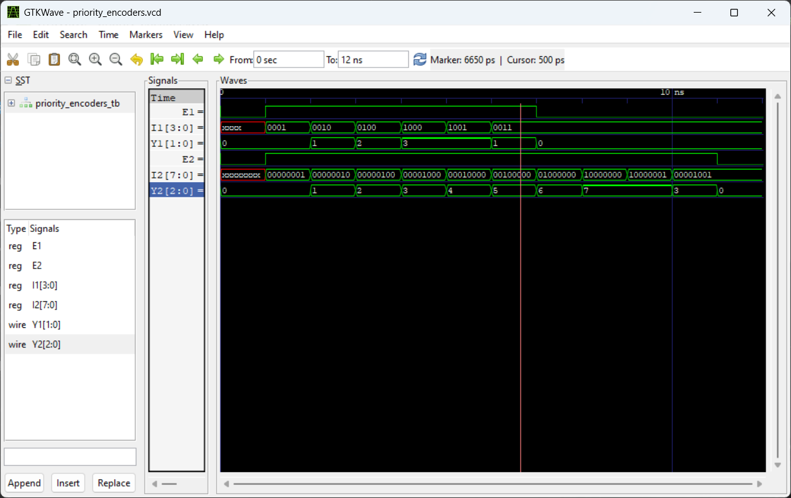
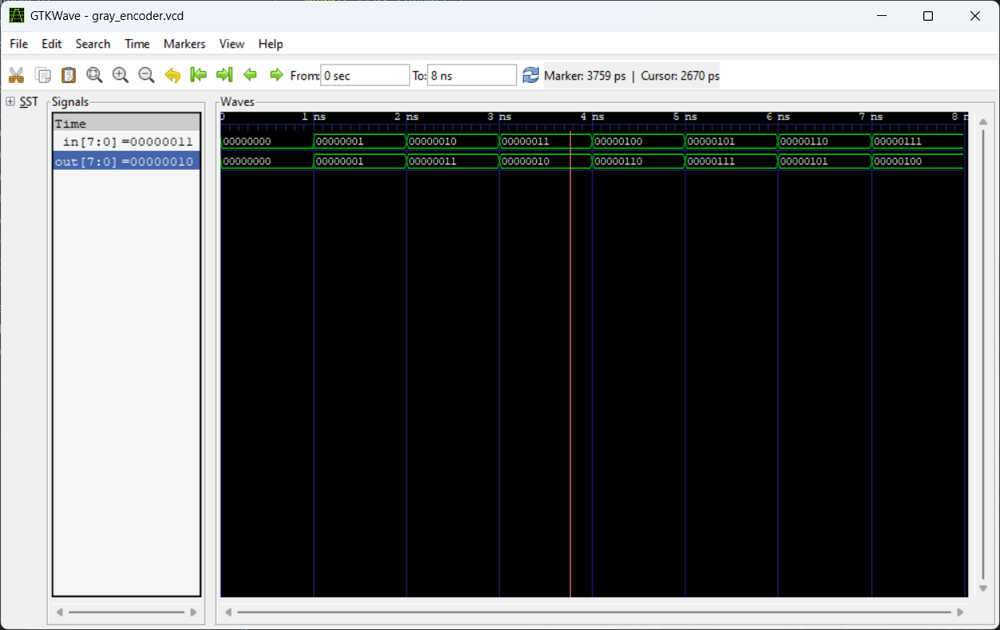
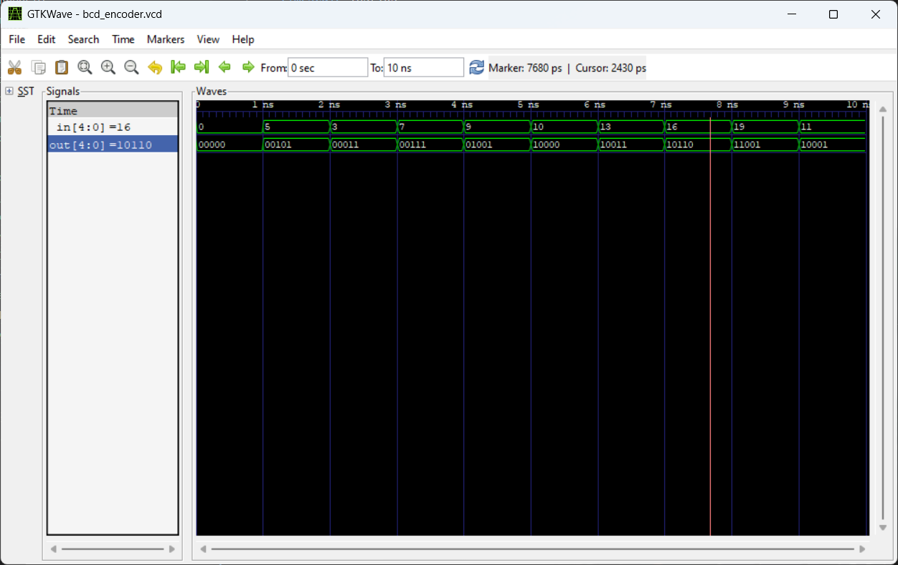
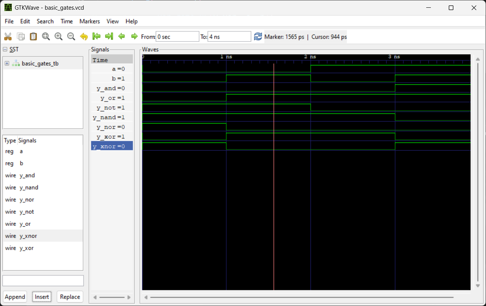

# Assignments

1. Decoder circuits (2x4, 3x8)
2. Encoder circuits (4x2, 8x3)
3. MUX (2x1, 4x1, Nx1)
4. DEMUX (1x2, 1x4, 1xN)
5. Priority encoder (8-bit binary to octal)
6. Gray encoder (8-bits input)
7. BCD encoder (input range is 0-19)
8. Basic logic gates using 2x1 MUX

## Screenshots of simulated waveforms

### 1. Decoder circuits (2x4, 3x8)

### 2. Encoder circuits (4x2, 8x3)

### 3. MUX (2x1, 4x1, Nx1)

### 4. DEMUX (1x2, 1x4, 1xN)

### 5. Priority encoder (8-bit binary to octal)

### 6. Gray encoder (8-bits input)

### 7. BCD encoder (input range is 0-19)

### 8. Basic logic gates using 2x1 MUX
