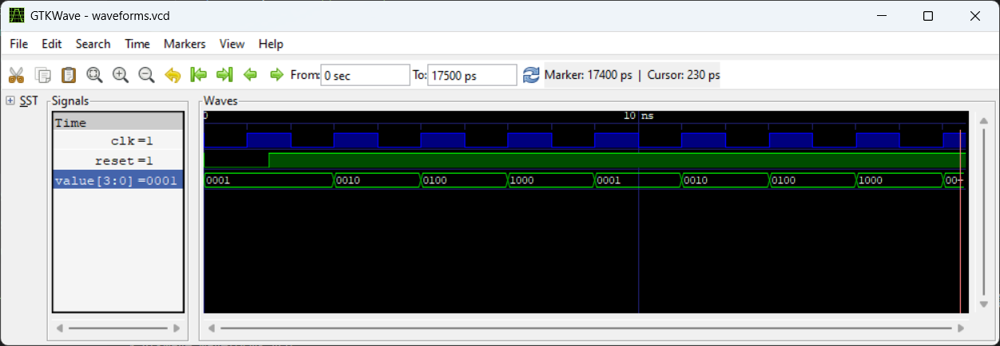
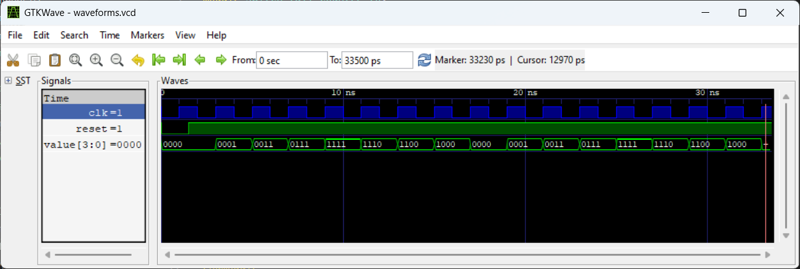
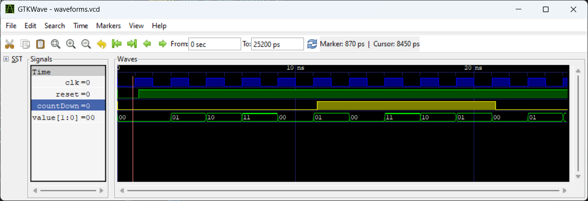
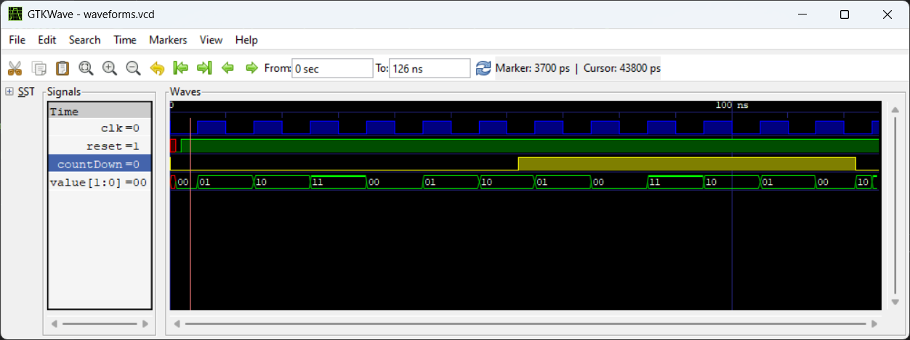
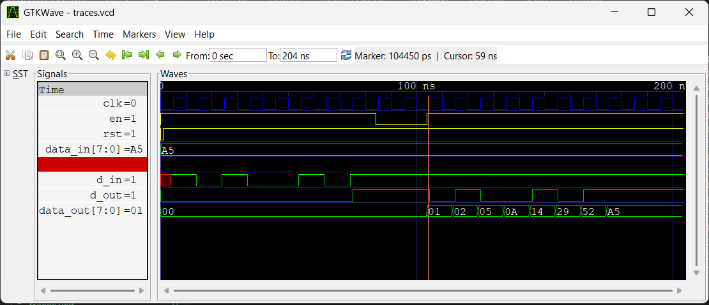
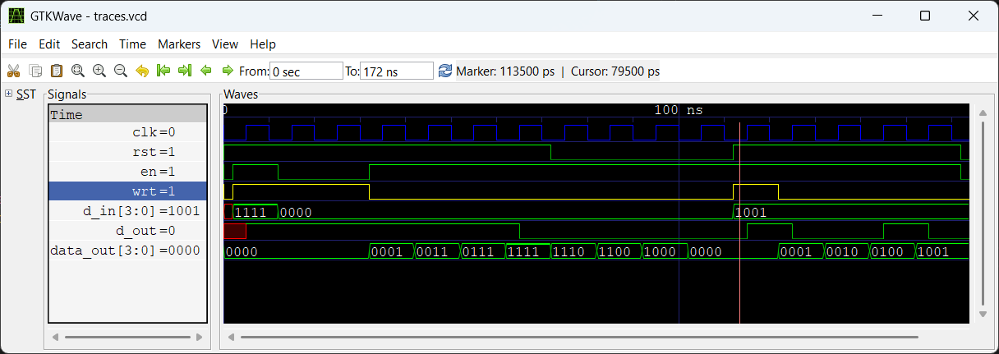
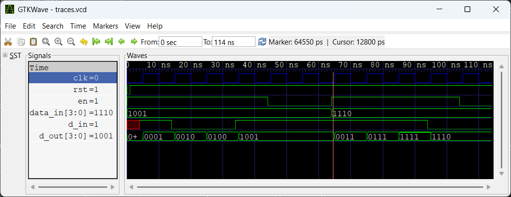

# Assignments

1. Synchronous Ring Counter
2. Switch Tail Counter (Johnson Counter)
3. Synchronous Up / Down Counter
4. Asynchronous Up / Down Counter
5. Serial In-Serial Out Register
6. Parallel In-Serial Out Register
7. Serial In-Parallel Out Register
8. Left Shift / Right Shift Register with Control
9. Counter which counts the sequence 1, 32, 62, 128 structural modelling only (using basic gates, no behavioral code)
10. BCD Counter with structural modelling (no behavioral code)
11. Button debounder (button should be pressed for 10ms at 100 Mhz clock to register)

## 1. Synchronous Ring Counter



## 2. Switch Tail Counter (Johnson Counter)



## 3. Synchronous Up / Down Counter



## 4. Asynchronous Up / Down Counter



## 5. Serial In-Serial Out Register



```
VCD info: dumpfile traces.vcd opened for output.
#    6 >>  en = 1  rst = 1  d_in = 1  d_out = 0  data_in = 10100101  data_out = 00000000
#   16 >>  en = 1  rst = 1  d_in = 0  d_out = 0  data_in = 10100101  data_out = 00000000
#   26 >>  en = 1  rst = 1  d_in = 1  d_out = 0  data_in = 10100101  data_out = 00000000
#   36 >>  en = 1  rst = 1  d_in = 0  d_out = 0  data_in = 10100101  data_out = 00000000
#   46 >>  en = 1  rst = 1  d_in = 0  d_out = 0  data_in = 10100101  data_out = 00000000
#   56 >>  en = 1  rst = 1  d_in = 1  d_out = 0  data_in = 10100101  data_out = 00000000
#   66 >>  en = 1  rst = 1  d_in = 0  d_out = 0  data_in = 10100101  data_out = 00000000
#   76 >>  en = 1  rst = 1  d_in = 1  d_out = 1  data_in = 10100101  data_out = 00000000
#   86 >>  en = 0  rst = 1  d_in = 1  d_out = 1  data_in = 10100101  data_out = 00000000
#   96 >>  en = 0  rst = 1  d_in = 1  d_out = 1  data_in = 10100101  data_out = 00000000
#  106 >>  en = 1  rst = 1  d_in = 1  d_out = 0  data_in = 10100101  data_out = 00000001
#  116 >>  en = 1  rst = 1  d_in = 1  d_out = 1  data_in = 10100101  data_out = 00000010
#  126 >>  en = 1  rst = 1  d_in = 1  d_out = 0  data_in = 10100101  data_out = 00000101
#  136 >>  en = 1  rst = 1  d_in = 1  d_out = 0  data_in = 10100101  data_out = 00001010
#  146 >>  en = 1  rst = 1  d_in = 1  d_out = 1  data_in = 10100101  data_out = 00010100
#  156 >>  en = 1  rst = 1  d_in = 1  d_out = 0  data_in = 10100101  data_out = 00101001
#  166 >>  en = 1  rst = 1  d_in = 1  d_out = 1  data_in = 10100101  data_out = 01010010
#  176 >>  en = 1  rst = 1  d_in = 1  d_out = 1  data_in = 10100101  data_out = 10100101
#  186 >>  en = 1  rst = 1  d_in = 1  d_out = 1  data_in = 10100101  data_out = 10100101
#  196 >>  en = 1  rst = 1  d_in = 1  d_out = 1  data_in = 10100101  data_out = 10100101
tb.v:42: $finish called at 2040 (100ps)
```

## 6. Parallel In-Serial Out Register



```
VCD info: dumpfile traces.vcd opened for output.
#  10 >>  rst = 1  en = 1  wrt = 1  d_in = 1111  d_out = 1  data_out = 0000
#  20 >>  rst = 1  en = 0  wrt = 1  d_in = 0000  d_out = 1  data_out = 0000
#  30 >>  rst = 1  en = 0  wrt = 1  d_in = 0000  d_out = 1  data_out = 0000
#  40 >>  rst = 1  en = 1  wrt = 0  d_in = 0000  d_out = 1  data_out = 0001
#  50 >>  rst = 1  en = 1  wrt = 0  d_in = 0000  d_out = 1  data_out = 0011
#  60 >>  rst = 1  en = 1  wrt = 0  d_in = 0000  d_out = 1  data_out = 0111
#  70 >>  rst = 1  en = 1  wrt = 0  d_in = 0000  d_out = 0  data_out = 1111
#  80 >>  rst = 0  en = 1  wrt = 0  d_in = 0000  d_out = 0  data_out = 1110
#  90 >>  rst = 0  en = 1  wrt = 0  d_in = 0000  d_out = 0  data_out = 1100
# 100 >>  rst = 0  en = 1  wrt = 0  d_in = 0000  d_out = 0  data_out = 1000
# 110 >>  rst = 0  en = 1  wrt = 0  d_in = 0000  d_out = 0  data_out = 0000
# 120 >>  rst = 1  en = 1  wrt = 1  d_in = 1001  d_out = 1  data_out = 0000
# 130 >>  rst = 1  en = 1  wrt = 0  d_in = 1001  d_out = 0  data_out = 0001
# 140 >>  rst = 1  en = 1  wrt = 0  d_in = 1001  d_out = 0  data_out = 0010
# 150 >>  rst = 1  en = 1  wrt = 0  d_in = 1001  d_out = 1  data_out = 0100
# 160 >>  rst = 1  en = 1  wrt = 0  d_in = 1001  d_out = 0  data_out = 1001
# 170 >>  rst = 0  en = 0  wrt = 0  d_in = 1001  d_out = 0  data_out = 1001
tb.v:71: $finish called at 1720 (100ps)
```

## 7. Serial In-Parallel Out Register



```
VCD info: dumpfile traces.vcd opened for output.
#    6 >>  en = 1  rst = 1  d_in = 1  d_out = 0001  data_in = 1001
#   16 >>  en = 1  rst = 1  d_in = 0  d_out = 0010  data_in = 1001
#   26 >>  en = 1  rst = 1  d_in = 0  d_out = 0100  data_in = 1001
#   36 >>  en = 1  rst = 1  d_in = 1  d_out = 1001  data_in = 1001
#   46 >>  en = 0  rst = 1  d_in = 1  d_out = 1001  data_in = 1001
#   56 >>  en = 0  rst = 1  d_in = 1  d_out = 1001  data_in = 1001
#   66 >>  en = 1  rst = 1  d_in = 1  d_out = 0011  data_in = 1110
#   76 >>  en = 1  rst = 1  d_in = 1  d_out = 0111  data_in = 1110
#   86 >>  en = 1  rst = 1  d_in = 1  d_out = 1111  data_in = 1110
#   96 >>  en = 1  rst = 1  d_in = 0  d_out = 1110  data_in = 1110
#  106 >>  en = 0  rst = 1  d_in = 0  d_out = 1110  data_in = 1110
tb.v:41: $finish called at 1140 (100ps)
```