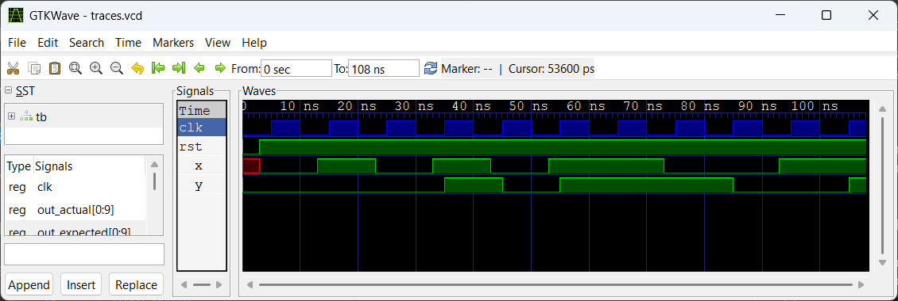
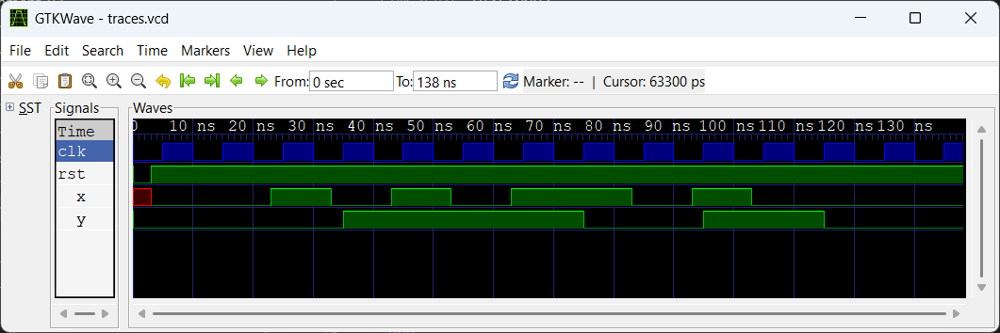
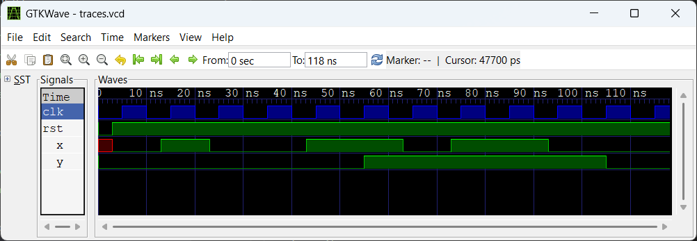

# Assignments

1. Design a FSM to detect more than one 1s in the last 3 samples
```
i/p: 0 1 0 1 0 1 1 0 0 1
o/p: 0 0 0 1 0 1 1 1 0 0  
```
2. Design FSM for a pattern matching block: Output is asserted 1 if pattern `101` is detected in the last 4 inputs.
```
i/p: 0 1 0 0 1 0 0 1 1 0 1 0 1 0
o/p: 0 0 0 1 1 0 0 0 0 0 1 1 1 1
```
3. Design an FSM which gives o/p 1 if alternate 1's & 0's zre present int last 3 samples else 0
```
i/p: 0 0 1 0 1 0 1 1 0 1 0 0 0
o/p: 0 0 0 1 1 1 1 0 0 1 1 0 0
```
4. It is required to eliminate short length pulses from a sampled data. It means 0's in continuous 1's have to be made 1 & similarly 1's in 0's are to made 0's as shown in the following eample. Give the FSM for the same.
```
i/p: 0 1 0 0 1 1 0 1 1 0 0
o/p: 0 0 0 0 0 1 1 1 1 1 0
```

## 1. Design a FSM to detect more than one 1s in the last 3 samples



```
VCD info: dumpfile traces.vcd opened for output.
seq_in      :  0101011001
out_actual  :  0001011100
out_expected:  0001011100
tb.v:34: $finish called at 1080 (100ps)
```

## 2. Design FSM for a pattern matching block: Output is asserted 1 if pattern `101` is detected in the last 4 inputs.


```
VCD info: dumpfile traces.vcd opened for output.
seq_in      :  0101001101010
out_actual  :  0001100001111
out_expected:  0001100001111
tb.v:34: $finish called at 1380 (100ps)
```

## 3. Design an FSM which gives o/p 1 if alternate 1's & 0's zre present int last 3 samples else 0



```
VCD info: dumpfile traces.vcd opened for output.
seq_in      :  0010101101000
out_actual  :  0001111001100
out_expected:  0001111001100
tb.v:34: $finish called at 1380 (100ps)
```

## 4. It is required to eliminate short length pulses from a sampled data.



```
VCD info: dumpfile traces.vcd opened for output.
seq_in      :  01001101100
out_actual  :  00000111110
out_expected:  00000111110
tb.v:34: $finish called at 1180 (100ps)
```